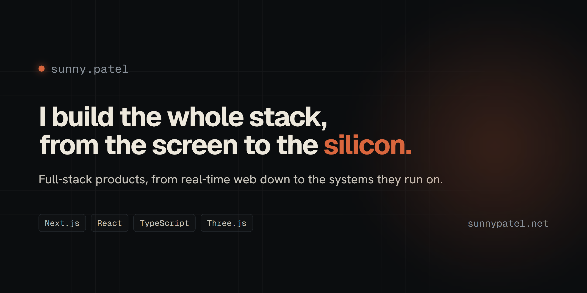

<div align="center">



<h1>Portfolio</h1>

<p><strong>The personal portfolio of Sunny Patel: a software developer who builds the whole stack, from real-time web down to the systems it runs on.</strong></p>

[](https://www.sunnypatel.net)
[](https://github.com/sunnypatell/Portfolio/actions/workflows/ci.yml)
[](LICENSE)

<a href="https://www.sunnypatel.net"><strong>Visit the site &rarr;</strong></a>

</div>

---

## What this is

A personal site built from scratch to do three things at once: stand as a personal brand, load fast on a phone, and still land an interactive 3D hero on a capable desktop. It runs on the Next.js App Router with a strict TypeScript codebase, a single content source of truth, and a server-side contact pipeline. No site template, no page builder.

## Highlights

- **An interactive 3D hero** that is gated by device capability, so phones and low-power machines get a static poster and never download the model, and the render loop pauses when it scrolls offscreen.
- **One content source of truth.** Every page, project, and piece of metadata reads from a single typed content module, so the site cannot drift out of sync with itself.
- **A real contact pipeline,** not a `mailto:`. The server route validates input, screens with a honeypot, rate-limits per IP, optionally verifies reCAPTCHA, and sends through an email provider, degrading gracefully when no keys are configured.
- **A live usage counter** that reads a public stat and counts up from zero, the same number shown on the live app it tracks.
- **SEO handled at the framework level:** per-route metadata, Open Graph and Twitter cards, JSON-LD, a generated sitemap and robots, and a dynamic social image.
- **Accessibility as a baseline:** a skip link, a focus ring that stays visible on every surface, managed focus on the mobile menu, semantic landmarks, and full reduced-motion support down to disabling smooth scroll.

## Why this stack

Chosen for a content site that has to be cheap to serve under traffic, rank well, and still host real interactivity. It is not framework-by-default.

| Layer | Choice | Why |
| --- | --- | --- |
| Framework | **Next.js (App Router)** | Server Components for fast first paint, file-based metadata, sitemap, robots, and social image so SEO is native rather than bolted on, static rendering for content routes, and built-in image optimization to keep data transfer low. |
| UI | **React + TypeScript (strict)** | Concurrent React with strict types, so the single content source stays honest. |
| 3D | **React Three Fiber + drei** | Declarative Three.js for the hero, lazy-loaded and gated by device capability. |
| Motion | **GSAP + Lenis** | One shared animation loop drives smooth scroll and scroll-triggered timelines together, and both stand down under reduced motion. |
| Styling | **Tailwind CSS** | CSS-first design tokens with no runtime, one source for the palette. |
| Validation | **Zod** | Schema validation at the contact API boundary. |
| Analytics | **Vercel Analytics + Speed Insights** | Lightweight, privacy-friendly, real-user metrics. |

## Running locally

Use the Node version pinned in `.nvmrc`.

```bash
npm install
cp .env.example .env.local   # optional, see the file for what each value does
npm run dev
```

Lint and a production build:

```bash
npm run lint
npm run build
```

## Performance and accessibility

Imagery is served as WebP through the framework's image pipeline with explicit dimensions, so the layout never shifts and only the right size ships per viewport. The 3D scene and its model download only on capable, in-view devices. Smooth scroll, parallax, and scroll-triggered reveals all respect reduced motion, and keyboard paths are first-class: a skip link, a focus ring that clears contrast on any background, and focus trapping with restoration on the mobile menu.

## License

Source-available, not open-source. You are welcome to read and learn from the code; please do not redeploy it as your own site or reuse the content, design, or personal branding. See [LICENSE](LICENSE).

## Citation

If you reference this project, see [CITATION.cff](CITATION.cff) or use GitHub's "Cite this repository".

## Author

<table>
  <tr>
    <td>
      <strong>Sunny Patel</strong><br/>
      Software developer, Greater Toronto Area
    </td>
    <td>
      <a href="https://www.sunnypatel.net">Website</a> &middot;
      <a href="https://github.com/sunnypatell">GitHub</a> &middot;
      <a href="https://www.linkedin.com/in/sunny-patel-30b460204/">LinkedIn</a> &middot;
      <a href="mailto:sunnypatel124555@gmail.com">Email</a>
    </td>
  </tr>
</table>
